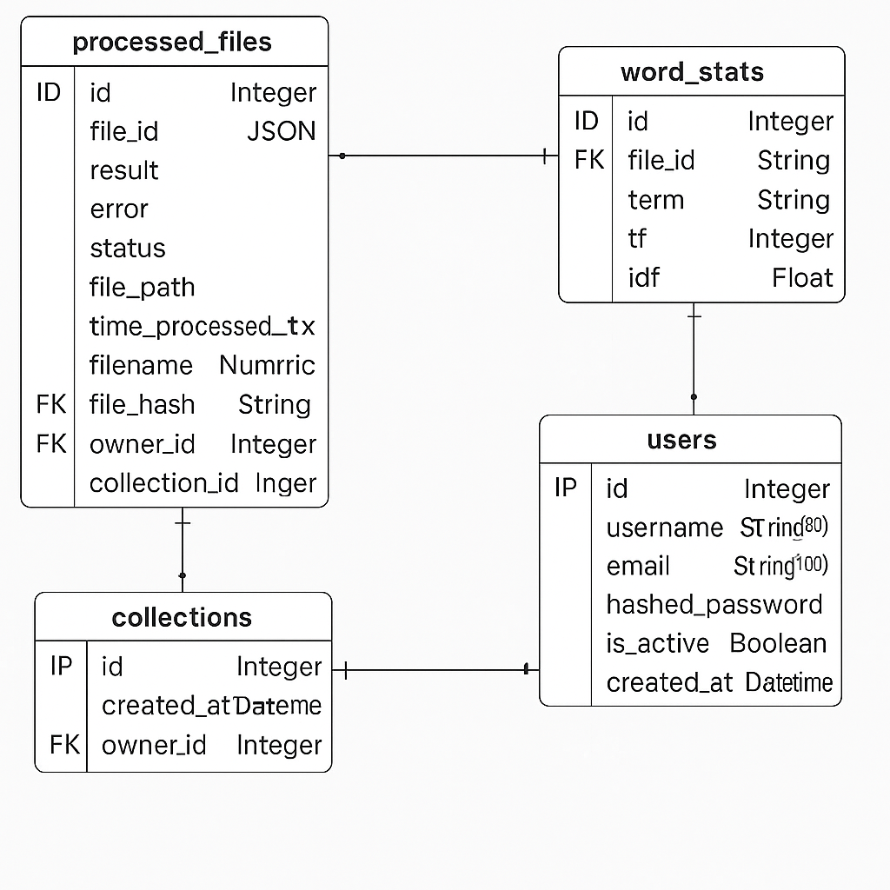

# Сервис tfidf 

Сервис tfidf .

## Версия приложения
V 0.1.1

## Требования:

Установите необходимое программное обеспечение:

1. [Docker Desktop](https://www.docker.com).
2. [Git](https://github.com/git-guides/install-git).
3. [PyCharm](https://www.jetbrains.com/ru-ru/pycharm/download) (optional).


## Описание структуры проекта

<details>
<summary>Дерево проекта</summary>

```
testTaskLastaGames/
│
├── docs/                     # Автосгенерированная документация проект
├── prometheus_data/          # Директория для prometheus 
│   └── FastAPIO.json         # Настройка для dashboard prometheus
├── grafana_data/             # Директория для grafana
│   └── prometheus.yml        # Настройка grafana
├── app/                      # проект
│   ├── alembic/              # Директория с результатами миграций моделей 
│   │   ├── versions/         # Директория с миграциями
│   │   ├── env.py            # Настройки Alembic
│   │   └── ...
│   ├── models/               # Пакет с моделями проекта и подключением к БД
│   │   ├── __init__.py
│   │   ├── database.py       # Модуль с настройками подключения к БД
│   │   └── models.py         # Модуль в котором описаны модели приложения
│   ├── templates/            # Директория с шаблонами проекта (Frontend )
│   │   └── index.html        # 
│   ├── tests/                # Директория с тестами проекта
│   │   └── ...
│   ├── uploads/              # Данная директория создстся автоматически когда приложение будет запущенно
│   │   └── ...
│   ├── alembic.ini           # ini фвйл настроек Alembic
│   ├── dfidf.py              # Модуль в котором описан класс для работы алгоритма df-idf
│   ├── main.py               # Основной модуль для запуска приложения
│   ├── schemas.py            # Модуль в котором хранятся схемы Pydantic для обработки данных
│   ├── serialize.py          # Модуль для сериализации даты и времени
│   ├── services.py           # Сервисный слой для бизнесс логики приложения
│   ├── settings.py           # Настройки приложения через Pydantic
│   ├── tasks.py              # Модуль обработки задач Celery
│   └── worker.py             # Модуль настроек Celery
├── Dockerfile
├── docker-compose.yml        # Основной Docker Compose файл
├── .env.sample               # Файл для настроек переменных окружения
├── .gitignore                # Файл gitignore служит для игнорирования файлов для git
├── .pylintrc                 # 
├── black.toml                # 
├── LICENSE                   # Файл лицензии
├── Makefile                  # Makefile Файл приложения для удобства сборки проекта и других манипуляций с проектом
├── pytest.ini                # Файл настройки pytest
├── requirements.txt          # Файл зависимостей проекта
├── setup.cfg                 # Файл установки настроек линтеров
└── README.md
```
</details>


## Конфигурируемые параметры
Все конфигурируемые параметры находятся в файле .env.sample и разделены по блокам
## Установка

Клонируйте репозиторий на ваш компьютер.

1. Для настройки приложения скопируйте файл `.env.sample` в файл `.env`:
    ```shell
    cp .env.sample .env
    ```
   
    Этот файл содержит переменные окружения, которые будут использоваться в приложении. Примерный файл `.env.sample`) содержит набор переменных с настройками по умолчанию. Его можно настроить в зависимости от окружения.

2. Постройте контейнер с помощью Docker Compose:
    ```shell
    docker compose build
    ```
    Эта команда должна быть выполнена из корневой директории, где находится `Dockerfile` .
    Также нужно будет заново построить контейнер, если вы обновили `requirements.txt`.

3. Для корректной работы приложения настройте базу данных. Примените миграции для создания таблиц в базе данных:
    ```shell
    docker compose run lesta-games-app alembic upgrade head
    ```

4. Теперь можно запустить проект внутри Docker контейнера:
    ```shell
    docker compose up
    ```
   Когда контейнеры будут запущены, сервер начнёт работать по адресу [http://0.0.0.0:8010/docs](http://0.0.0.0:8010/docs). Вы можете открыть его в браузере.

## Использование

### Миграции

Для первоначальной настройки функционала миграций выполните команду:
```bash
docker compose exec lesta-games-app alembic init -t async migrations
```
Эта команда создаст директорию с конфигурационными файлами для настройки функционала асинхронных миграций.

Для создания новых миграций, которые обновят таблицы базы данных в соответствии с обновлёнными моделями, выполните команду:
```bash
docker compose run lesta-games-app alembic revision --autogenerate  -m "your description"
```

Чтобы применить созданные миграции, выполните:
```bash
docker compose run lesta-games-app alembic upgrade head
```

### Автоматизированные команды

Проект содержит специальный `Makefile` который предоставляет ярлыки для набора команд:
1. Построить Docker контейнер:
    ```shell
    make build
    ```

2. Сгенерировать документацию Sphinx:
    ```shell
    make docs-html
    ```

3. Автоформатировать исходный код:
    ```shell
    make format
    ```

4. Статический анализ (линтеры):
    ```shell
    make lint
    ```


6. Run autoformat, linters and tests in one command:
    ```shell
    make all
    ```

Запускайте эти команды из исходной директории, где находится `Makefile`.

## Документация

Проект интегрирован с системой документации [Sphinx](https://www.sphinx-doc.org/en/master/) Она позволяет создавать документацию из исходного кода. Исходный код должен содержать docstring'и в формате [reStructuredText](https://docutils.sourceforge.io/rst.html) .

Чтобы создать HTML документацию, выполните команду из исходной директории, где находится `Makefile`:
```shell
make docs-html
```

После генерации документацию можно открыть из файла `docs/build/html/index.html`.

## License
[MIT](https://choosealicense.com/licenses/mit/)

## Changelog


```
README.md
- Добавлено описание структуры проекта
- Добавлено changelog
- Добавлено версия приложения
- Добавлено Описание всех конфигурируемых параметров

routs
- Добавил маршрут status - для проверки работоспособности приложения
- Добавил маршрут version - для получения версии приложения
- Добавил маршрут metrics - для отображения метрик приложения (prometheus)

Приложение
- настроил settings так как Pydantic поменял схему ипорта
- добавил зависимость pydantic-settings
- добавил зависимость prometheus-fastapi-instrumentator для работы с prometheus

Контейнеры
- добавлены контейнеры prometheus и grafana для сбора и отображения метрик прилодения


Вторая неделя:
models.py
- добавил модели
- создал миграцию

main.py
- добавлено версионирование апи и тегироване
- разделил endpoints по отдельным модулям

```


## Структура таблиц сущностей в БД


1. Миграции лучше стараться называть максимально коротко и ясно, ну и желательно сохранять историю миграций, а не удалять при пуше (ну тут от ситуации, если сток продукт выкладывать то ок, если пушить проект и везти его, то оставлять)

2. В файле алембика env.py почитай про надстройку compare_server_default=True, в этом проекте не сильно важно, но в будущем может пригодиться

3. При регистрации не валидируешь ни пароль ни мыло, т.е. пользователь может все что угодно вводить

4 .В readme не правильно указана команда docker-compose build, в оригинале при установке на вм, необходимо добавить sudo или добавить пользователя в группу docker ```sudo usermod -aG docker $USER```

5. Не совсем понял зачем нужно прописывать вручную накат миграций, если ты это можешь делать сразу при развертывании контейнера app

6. Также при создании миграций, нужно заходить в контейнер с приложением создавать директорию с файлами для асинхронных миграций, хотя это можно сделать в самой DSN строке при прокидовании ее в конфигурационном файле alembic с добавлением строки "?async_fallback=True" к основному DSN

7. По твоему readme не билдится контейнера, падают с ошибкой на 5 шаге:

Purging configuration files for libsasl2-modules:amd64 (2.1.28+dfsg-10) ...
Purging configuration files for libldap-common (2.5.13+dfsg-5) ...
Purging configuration files for libfakeroot:amd64 (1.31-1.2) ...
Purging configuration files for dirmngr (2.2.40-1.1) ...
Purging configuration files for fonts-dejavu-core (2.37-6) ...
Removing intermediate container 27f4b96354e9
 ---> b28f8b1318d5
Step 4/9 : COPY ./requirements.txt ./setup.cfg ./black.toml ./.pylintrc /
 ---> a4227bbe07cb
Step 5/9 : RUN --mount=type=cache,target=/root/.cache/pip     pip install --upgrade pip -r /requirements.txt
the --mount option requires BuildKit. Refer to https://docs.docker.com/go/buildkit/ to learn how to build images with BuildKit enabled
ERROR: Service 'lesta-games-app' failed to build : Build failed

в общем я бы доработал readme более подробно.

Обрати внимание на Changelog и как ты его ведешь, мне понравилась [статья](https://www.conventionalcommits.org/ru/v1.0.0/) и я ее придерживался

